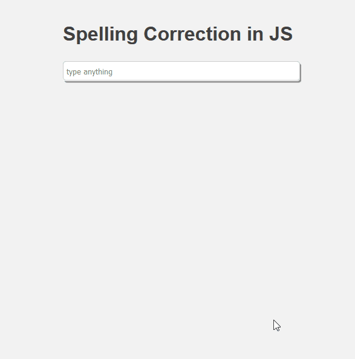

## Spelling Correction JS

This is a very simple spelling correction Script based on JavaScript for live suggestions for misspellings a user could
make during a form entering process. Based on your experience you can just implement the script and use the classes and
ids provided in test_page.html.

#### Limitations
At the moment only words with one modification distance are taken into consideration.
All improvements are limited to a single word per correction.

#### Future Improvements:
1. Suggestions are not only based on a single frequency distribution rather than a depended probability connected to the
previous word.

2. Suggestions include also words with more than one modification distance.

#### Support
There is no support. Script will be enriched, whenever I have to much time :D.

#### Licence Creative Common
Feel free to use it or to build upon. Just reference me, whenever you use it for your blog posts or other stuff.
I was inspired by norvig: norvig.com
